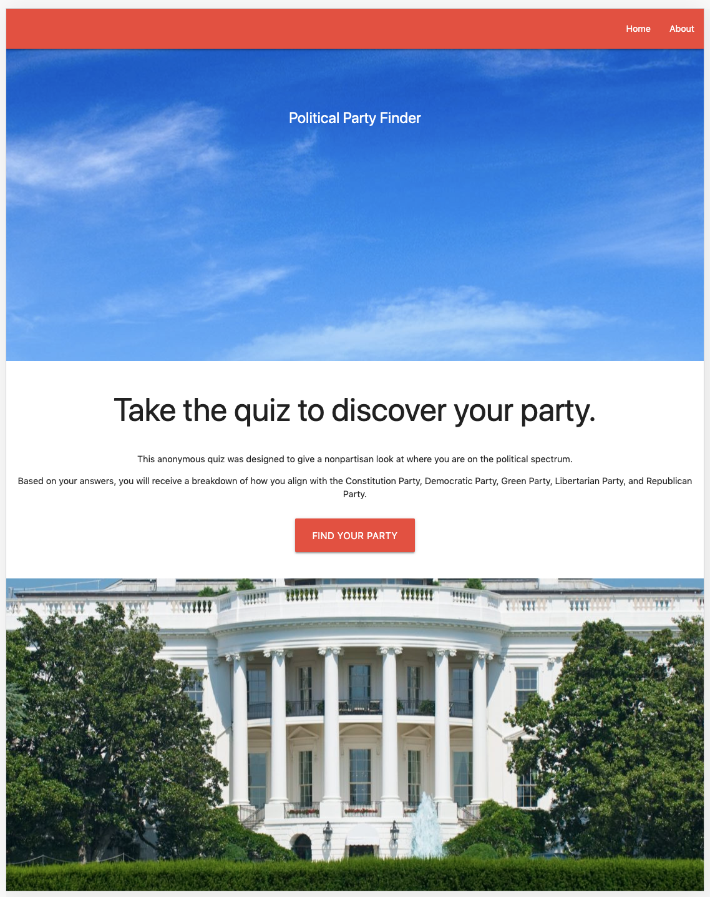
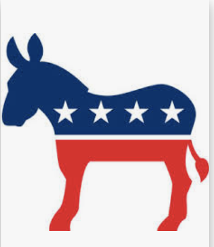

# Political-Quiz

Answer a questionnaire, the app will help you identify the political party you align with

` We are using the top 5 political parties according to Wikipedia.`

#### The 5 parties are: Democrat, Republican, Libertarian, Constitution, Green

` The user chooses a value from 1 - 5 for each question, 5 means the issue matters to you the most. `
` There are 20 questions, the app will compute the results, and then will display the party you most align with. `